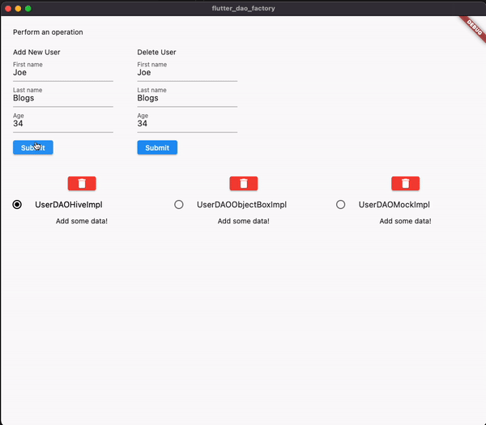

# Dao Factory Design Pattern in Flutter

Implementing the dao factory pattern in Flutter. 

Demonstrates the use of varied DAO implementations as defined in a configuration file, as well as switching the DAO  implmentation during runtime. 

# Demo 
Easily switch between 3 different persistence DAO implementations with minimal changes to application layer code. 



# Introduction
- You may want to use different persistence providers depending on the state of the app, or the platform. I.e. suppose there was a situation where:
    - You had to use Hive for Android platform, and ObjectBox for Ios. 
    - You had to use Hive if a User was not signed in, but once they were signed in, you would rather use Firestore.
    - You want to future-proof your application and do not want to tie yourself to any one particular implementation. For example, you may have started off with `sqflite` but realised later on you want your application to support Web, which `sqflite` does not support at the time of writing. Using this pattern, you can easily plug in a web-supported persistence implementation, such as `hive` with minimal refactoring. 
- Rather than scattering conditionals throughout your code, we can separate the implementation details of our persistence layer away from the application code using the Factory pattern. 
- For ease of demonstration, this example uses 2 local storage implementations - Hive & ObjectBox, for the purposes of persisting a User object. 
- If you wanted to switch out the DAO implementation for unit testing, this would then become as simple as creating a new DAOImpl that implments the `UserDAO` interface, and then wiring up a switch in `UserDAOFactory` to return a mockDAO, i.e. `if (isTest == true) return UserDAOMockImpl();`

# Implementation 
1. Create a DAOFactory class. 
2. This class will contain a getDAO method which returns the appropriate DAO implementation class based on some input. 
```dart
public static DAO getDAO(String type) {
    if (type == 'hive') {
        return DAOHiveImpl();
    } else {
        return DAOObjectBoxImpl();
    }
}
```
3. Create a DAO interface. (Abstract class in  Dart). 
4. Create your DAO implementation classes as [***Singletons***](https://refactoring.guru/design-patterns/singleton), i.e. one for Hive & one for ObjectBox, which implement the DAO interface, ensuring they have the same guaranteed functionalities. 
5. From the application code, we can make an implementation-agnostic call to the persistence layer, letting the `UserDAOFactory` object decide which DAO implementation to use.: 
```dart
UserDAOFactory.getUserDAO().addUser();
```

# Generating code
- Ensure the generators are installed as dev dependencies, i.e. `build_runner`, and `hive_generator` for Hive and `objectbox_generator` for ObjectBox
```
flutter pub run build_runner build
```

# References
https://refactoring.guru/design-patterns/factory-method
https://medium.com/flutter-community/flutter-design-patterns-10-factory-method-c53ad11d863f 
https://stackoverflow.com/questions/6401543/what-is-dao-factory-pattern
https://medium.com/flutter-community/flutter-design-patterns-1-singleton-437f04e923ce 

# Feedback 
Please feel free to comment any better solutions or feedback. We are always open for new ideas!


